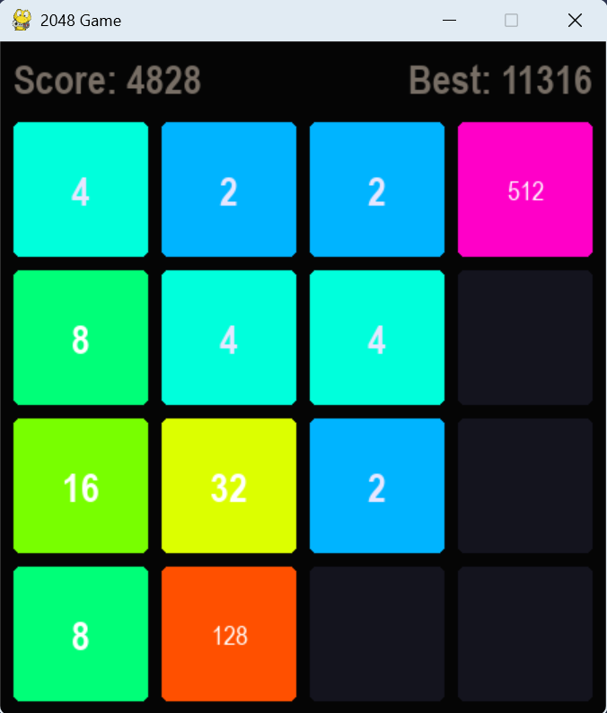

# 2048游戏

这是一个使用Python和Pygame实现的2048游戏。

## 游戏简介

2048是一款简单但有趣的数字方块游戏，玩家通过移动方块使相同数字的方块合并，目标是获得2048方块。

## 特性

- 使用Pygame图形界面
- 历史得分存档记录
- 人类模式与贪婪搜索的AI模式
- 个性化主题选择

## 操作方法

- 使用方向键(↑, →, ↓, ←)移动方块
- 按R键重新开始游戏
- 按A键切换模式
- 当两个相同数字的方块碰到一起时会合并
- 合并后的数值会累加到分数中

## 如何运行

1. 确保安装了Python和Pygame
```
pip install pygame
```
2. 运行main.py文件

## 项目结构

- `main.py`: 程序入口
- `game.py`: 游戏核心逻辑
- `ai.py`: 贪婪搜索AI
- `renderer.py`: 图形渲染
- `utils.py`: 工具和常量
- `records.txt`: 历史分数记录

## 许可证
No License

## 游戏截图

